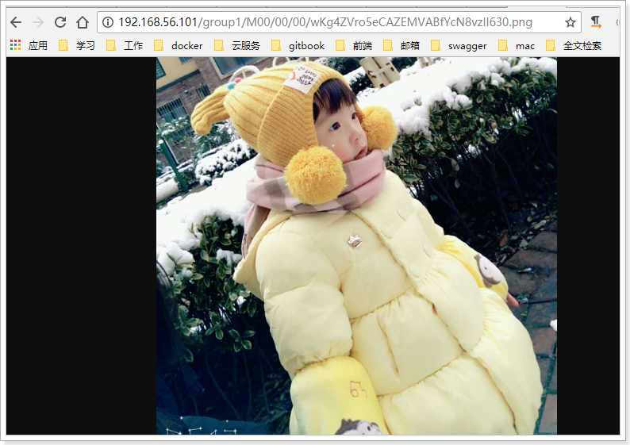
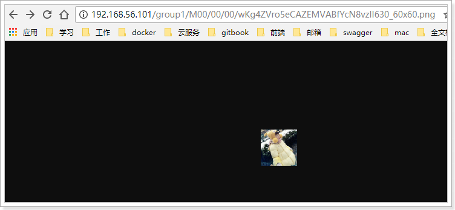

## 3.5.java客户端

余庆先生提供了一个Java客户端，但是作为一个C程序员，写的java代码可想而知。而且已经很久不维护了。

这里推荐一个开源的FastDFS客户端，支持最新的SpringBoot2.0。

配置使用极为简单，支持连接池，支持自动生成缩略图，狂拽酷炫吊炸天啊，有木有。

地址：[tobato/FastDFS_client](https://github.com/tobato/FastDFS_Client)

 

### 3.5.1.引入依赖

在父工程中，我们已经管理了依赖，版本为：

```xml
<fastDFS.client.version>1.26.2</fastDFS.client.version>
```

因此，这里我们直接引入坐标即可：

```xml
<dependency>
    <groupId>com.github.tobato</groupId>
    <artifactId>fastdfs-client</artifactId>
</dependency>
```


### 3.5.2.引入配置类

纯java配置：

```java
@Configuration
@Import(FdfsClientConfig.class)
// 解决jmx重复注册bean的问题
@EnableMBeanExport(registration = RegistrationPolicy.IGNORE_EXISTING)
public class FastClientImporter {
}
```

### 3.5.3.编写FastDFS属性

```yaml
fdfs:
  so-timeout: 1501
  connect-timeout: 601
  thumb-image: # 缩略图
    width: 60
    height: 60
  tracker-list: # tracker地址
    - 192.168.56.101:22122
```

### 3.5.4.测试

```java
@RunWith(SpringRunner.class)
@SpringBootTest(classes = LyUploadService.class)
public class FdfsTest {

    @Autowired
    private FastFileStorageClient storageClient;

    @Autowired
    private ThumbImageConfig thumbImageConfig;

    @Test
    public void testUpload() throws FileNotFoundException {
        File file = new File("D:\\test\\baby.png");
        // 上传并且生成缩略图
        StorePath storePath = this.storageClient.uploadFile(
                new FileInputStream(file), file.length(), "png", null);
        // 带分组的路径
        System.out.println(storePath.getFullPath());
        // 不带分组的路径
        System.out.println(storePath.getPath());
    }

    @Test
    public void testUploadAndCreateThumb() throws FileNotFoundException {
        File file = new File("D:\\test\\baby.png");
        // 上传并且生成缩略图
        StorePath storePath = this.storageClient.uploadImageAndCrtThumbImage(
                new FileInputStream(file), file.length(), "png", null);
        // 带分组的路径
        System.out.println(storePath.getFullPath());
        // 不带分组的路径
        System.out.println(storePath.getPath());
        // 获取缩略图路径
        String path = thumbImageConfig.getThumbImagePath(storePath.getPath());
        System.out.println(path);
    }
}
```

结果：

```
group1/M00/00/00/wKg4ZVro5eCAZEMVABfYcN8vzII630.png
M00/00/00/wKg4ZVro5eCAZEMVABfYcN8vzII630.png
M00/00/00/wKg4ZVro5eCAZEMVABfYcN8vzII630_60x60.png
```

访问第一个路径：



访问最后一个路径（缩略图路径），注意加组名：

 


### 3.5.5.改造上传逻辑

```java
@Service
public class UploadService {

    private static final Logger logger = LoggerFactory.getLogger(UploadController.class);

    // 支持的文件类型
    private static final List<String> suffixes = Arrays.asList("image/png", "image/jpeg");

    @Autowired
    FastFileStorageClient storageClient;

    public String upload(MultipartFile file) {
        try {
            // 1、图片信息校验
            // 1)校验文件类型
            String type = file.getContentType();
            if (!suffixes.contains(type)) {
                logger.info("上传失败，文件类型不匹配：{}", type);
                return null;
            }
            // 2)校验图片内容
            BufferedImage image = ImageIO.read(file.getInputStream());
            if (image == null) {
                logger.info("上传失败，文件内容不符合要求");
                return null;
            }

            // 2、将图片上传到FastDFS
            // 2.1、获取文件后缀名
            String extension = StringUtils.substringAfterLast(file.getOriginalFilename(), ".");
            // 2.2、上传
            StorePath storePath = this.storageClient.uploadFile(
                    file.getInputStream(), file.getSize(), extension, null);
            // 2.3、返回完整路径
            return "http://image.leyou.com/" + storePath.getFullPath();
        } catch (Exception e) {
            return null;
        }
    }
}
```


只需要把原来保存文件的逻辑去掉，然后上传到FastDFS即可。


### 3.5.6.测试

通过RestClient测试：

 

# 